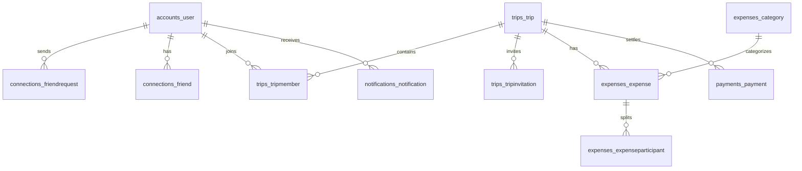

# PostgreSQL Schema

Core tables:
- `accounts_user`: UUID users, unique username/email, profile URL, bio, timestamps.
- `connections_friendrequest`, `connections_friend`: friend lifecycle and reciprocal graph edges.
- `trips_currency`, `trips_trip`, `trips_tripmember`, `trips_tripinvitation`: currencies, trips, role-based members, invitations.
- `expenses_category`, `expenses_expense`, `expenses_expenseparticipant`, `expenses_expensecomment`, `expenses_expenseaudit`: expense domain, participant balances, comments, edit history.
- `payments_payment`: settlement records.
- `notifications_notification`: in-app notification inbox.
- `activity_activitylog`: audit timeline.

## ER Diagram

